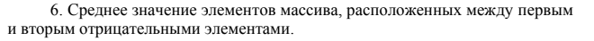

# Домашняя работа Лаб 11
## 1. Условие задачи
Вариант 6    
С одномерным массивом, состоящим из n вводимых с клавиатуры
положительных и отрицательных целых чисел выполнить следующие
вычисления:    

## 2. Контрольный пример
  Массив состоит из 7 чисел (n= 7): 1 2 3 -7 8 4 -2  
  Числа между отрицательными числами (-7 и -2): 8 4    
  Среднее значение чисел: (8+4)/2=12/2=6
### Алгоритм
1. **Начало**
2. Объявление переменных и задаем исходные числа:
   - int n
   - int a[100]
   - int i
   - int neg1 = -1, neg2 = -1
   - int sum = 0, count = 0
3. Ввод данных:
   - n
   - a[i]
3. Цикл for:
   - for (i = 0; i < n; i++) {
    scanf("%d", &a[i]); }
4. Цикл for с условиями:
   - for (i = 0; i < n; i++) {   
    if (a[i] < 0) {   
        if (neg1 == -1) {   
            neg1 = i;  }     
        else {
            neg2 = i;      
            break;    }     
5. Цикл for для поиска количества соличества и суммы:
   - for (i = neg1 + 1; i < neg2; i++) {
    sum += a[i];
    count++; }
5. Вывод результата:
   - (float)sum / count
5. **Конец**
### Блок-схема

[Ссылка](https://viewer.diagrams.net/?tags=%7B%7D&lightbox=1&highlight=0000ff&edit=_blank&layers=1&nav=1&title=%D0%9B%D0%B0%D0%B18.png&dark=auto#R%3Cmxfile%3E%3Cdiagram%20name%3D%22%D0%A1%D1%82%D1%80%D0%B0%D0%BD%D0%B8%D1%86%D0%B0%20%E2%80%94%201%22%20id%3D%22YBHr6eNzSqN0wLppfZb6%22%3E3Vrbbts4EP0aAd0FHOhiyfajFaddYFugQB66faQtWmIhiSpNx3a%2FvkORtC6UXW0SS22CQBGHt9GZM8MhGcu7z44fGCqSTzTCqeXa0dHyVpbrLuYePIXgJAX%2BdC4FMSORFDmV4JH8wEpoK%2BmeRHjXaMgpTTkpmsINzXO84Q0ZYowems22NG3OWqAYG4LHDUpN6RcS8URK5%2B6skv%2BDSZzomZ1gIWsypBurL9klKKKHmsh7sLx7RimXb9nxHqcCO42L7Pf%2BQu1ZMYZz3qdD5m8%2FrT78S7bfSBq4dML5mk%2BmcpQnlO7VBytl%2BUkjgCMARBUp4wmNaY7Sh0oaMrrPIyymsaFUtflIaQFCB4TfMOcnZV205xRECc9SVSvnFBNd%2FDYl2tE92%2BArH6T054jFmF9p550tAMzFNMOcnaAfwyni5KmpB1Icis%2FtKpjhRSH9P1B3TdQBusVKPEPbAkzmM%2F0Oz7B8PpiWSVNwA2GBQ0I4fixQCc0BHLEL3yfMOD5eR9hERHXwporGh8oLHE3tpOYBc%2FtGoAVvjapeT6r6Y1LV60A9SEHdcEvhgyGwE1bKg%2B97EcnCErJzqWEfLRREJBBiJyglcW55S6FEnmBGZJeqcxCrv0PPKNyxdMrQVc4nnlOBsOUCknYOTVEm%2FCxf74qakoCy1LOpuyFuURdWh0K8ApFQmuKUxgxl0LAAHcGSmLXrPlcVv3L%2FLTlivbS%2Bdjg46eW6Z3gIbhUe5m8tPPg9w8NszPDgG6gXjEb7jfDTsmw7hhkGXKw0O%2Bdjs1Ons2%2BHnrOe9FyMSc%2BZgTo5E9M2DDA8Md3Z6MTsyEX%2FbGIuehLTuWCqYZjpdCRWIumYqry%2FywYf0Ro21w3cVD6z2gBMZSqgM52lqshIFEkT4R35gdbleMJIBSU5L7%2FKDy1%2FpdIrnSUsrvFd7bXVYNZ5h1u31hWyXfSOiX3nwY8crLcZ1HCfxffUmtDtdgf2b9vpPOsLdm%2B%2FRywHqNnpP9W%2FLHwVhTtfF1fHeuXqpEojuNqlqPhcGx9b0VNF06nTipJSMdWrIsKSMXSqNVOucHker3ue9z3bB8328CI1eFVWLrqXOr1LkZuQcuHLDbayhGbr%2FW6ggwS%2FAY7XtQQ6Qx4sOGYSO64%2FVy78tV73Yn%2F%2B9ZI4vYmfToOmP%2Fhey5Qy0Bh%2Bagzkz1uOuLiNw7fn0Qrf1IEdx6BhtZf6W7ruOwSPiRiplIEv%2F2VQdfgs1h998%2B%2BY59iAUFj%2BDg6P77ZYOjo8btcp3u8T4ezhMpbeodC9USh0ZnfN9W9m94thr5a9mmFGn3Y61jzsPPM8x6EWZ%2F7wQ0t%2F9GMht%2BP%2BTRhjWTOAvBXyS%2FMEptuOcQfUpu5od0Jun0uhPFqKi2Ao5TTHTVSaMe32AerZKVgNYr8DYS17aXiymxb2%2FOdmau2B3GEyNa3wMzM1KFYX8rJ59V8N3sNP%3C%2Fdiagram%3E%3C%2Fmxfile%3E)

## 2. Реализация программы:
      #include <stdio.h>
      #define _CRT_SECURE_NO_DEPRECATE
      #include <stdlib.h>
      #include <locale.h>
      #include <math.h>
      #define _USE_MATH_DEFINES
      #define _CRT_SECURE_NO_WARNINGS
      int main() {
          setlocale(LC_ALL, "RUS");
          int n;
          int a[100];
          int i;
          int neg1 = -1, neg2 = -1;
          int sum = 0, count = 0;
      
          printf("n = ");
          scanf("%d", &n);
      
          for (i = 0; i < n; i++) {
              scanf("%d", &a[i]);
          }
      
          // Поиск двух отрицательных элементов в одном цикле
          for (i = 0; i < n; i++) {
              if (a[i] < 0) {
                  if (neg1 == -1) {
                      neg1 = i;      // Первый отрицательный
                  }
                  else {
                      neg2 = i;      // Второй отрицательный
                      break;         // Выходим из цикла
                  }
              }
          }
      
          // Вычисление среднего
      
          for (i = neg1 + 1; i < neg2; i++) {
              sum += a[i];
              count++;
          }
      
          printf("Среднее: %.2f\n", (float)sum / count);
      
          return 0;
      }
    
## 3. Результаты работы программы

## 4. Информация о разработчике

Гусев Степан, бИЦ-251

